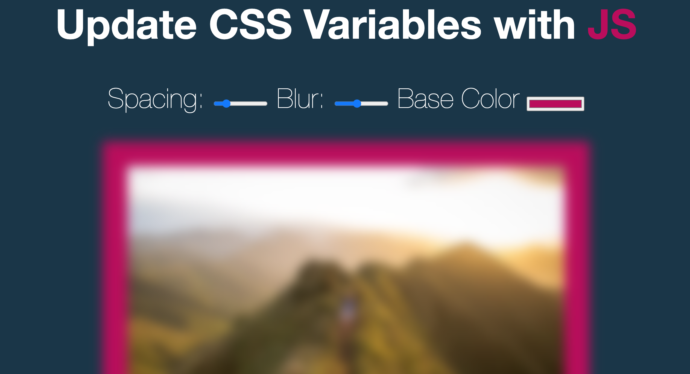

# Update CSS variables with JS

Day 3 of JavaScript30. Made sliders which sets the images's padding and blurness. There is also a color picker which sets the word "JS" and the background of the image to the selected colour

# Demo

# Technologies Used

Vanilla JS, HTML5, CSS

# Website

https://buigabor.github.io/JS-clock/
